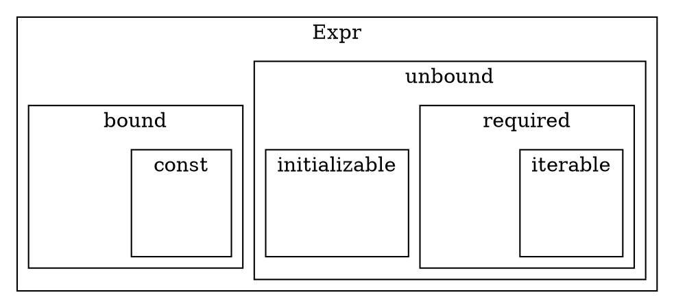

# Metalang

[TOC]

## Motivation

Defining the loss functions and optimization strategies used during training for
Flax modules involves a fair amount of boilerplate. When defining
multi-objective or multi-scale training regimes this results in a good amount of
duplicated, nontrivial code. Metalang strives to provide a system for defining a
training regime (including loss function etc) independent of the optimized
module or the learning task (EG it makes it possible to define "SGD using cross
entropy loss for X weights, ADAM using L2 for Y weights" independent of the
model being optimized or the dataset being learned.

## Design

Metalang was designe dwith bidirectional interoperability with Flax and JAX
compatibility top of mind.

### Expr

Expressions are the building blocks for the lazy evaluation engine. Expressions
can be described by the following property hierarchy:



All expressions contain the details necessary to compute its value provided all
predicate expressions.

*   Bound Expressions

    Bound expressions are expressions who's value is determined by evaluating
    some function with some values assigned to predicate expressions. Note that
    it is valid for a bound expression to have no predicates, in which case it
    is effectively a constant (and thus it is deemed a const expression).

*   Const Expressions

    These are any Bound Expressions without any predicates.

*   Unbound Expressions

    These expressions have no predicates, but also don't have any assigned
    value. These can be thought of generally as placeholders or variables. In
    order to evaluate an expression with any unbound expressions in its
    predicates, values for all unbound expressions must be provided.

*   Required Expressions

    These are unbound expressions that provide no initialization information.

*   Iterable Expressions

    These are special required expressions that provide a shared data stream
    assignment. Rather than individually providing values for Iterable
    expressions, a single list of values may be provided under the iterable
    variable name and values will be assigned to all associated Iterable
    Expressions.

*   Initializable Expressions

    These expressions contain information needed to initialize their value.

### Unusual functionality

Most functionality provided is expected for any lazy evaluation framework. For
example function valued expressions maybe be called. This produces an expression
with the value of the result of the expressions function invoked with the value
of the arguments' values.

#### Initialization

Unbound expressions may provided details for how they should be initialized. All
initializable predicates of an expression may be initialized and returned.
Because initial values may themselves be expressions, there is a concept of
init\_predicates of an expression. These are all of the values that must be
provided in order to initialize all initializable predicates of an expression.

#### Partial Evaluation

Any expression may be partially evaluated given some set of known values. The
result will be a new expression with the provided partial assignment bound to
their expressions. As an implementation detail, this replaces the assigned
expressions with const expressions of their evaluated value. It also performs
constant propagation to ensure fully constrained expressions don't get
re-evaluated. A common pattern is to define an Expr representing some parametric
function where control parameters are "Required" predicates. Users may then
create their specific function by partially evaluating this generator expression
with assignments for all Required predicates.

#### WRT

To better support optimization applications it is possible to construct a
function valued expression for any expression with respect to any other
expressions (usually expressions within the predicate chain of the target
expression). The produced expression when evaluated will produce a function that
takes in values for the wrt arguments and produces the result of the target
expression. A (somewhat motivating) example can be seen below:

```py
x = expr.required("x")
z = expr.wrap(jax.nn.softmax)(x)
y = expr.required("y")

distance = (z - y) ** 2

fn1 = distance.wrt(z).eval({y: 100})
fn2 = distance.wrt(x).eval({y: 100})
```

is equivalent to:

```py
def fn1(z):
  return (z - 100) ** 2
def fn2(x):
  return (jax.nn.softmax(x) - 100) ** 2
```

This is compatible with jax jitting and autograd and is particularly useful for
defining functions that are subject to optimization with respect to the
specified arguments.

#### Iterables

To better support streams of data, there is native support for Iterable
expression that are bound by a common addressing name. These expressions
generally operate similarly to regular required expressions, however they
support a shorthand assignment during. This allows the user to specify a list of
values that will get propagated to all iterable Exprs of the shared group. This
is particularly useful for datasets and random number generators. There is also
built in support for counting the number of values needed for evaluation of a
particular expression. A (not particularly motivating) example:

```py
ds = expr.IterableVar('dataset')
a = expr.var(a)
sum = expr.const(0)
for _ in range(3):
  sum += (ds.next() - a) ** 2
fn = sum.wrt(a).eval({ds:[1,2,3]})
```

is equivalent to:

```py
def fn(a):
  return (a-1)**2 + (a-2)**2 + (a-3)**2
```
